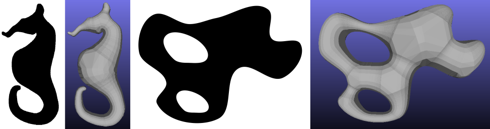

################## Implementation of: ##################

Delaunay Inflation algorithm for 2D to 3D conversion introduced in:

Paper Title:- A digital assistant for shading paper sketches

Authors:- Amal Dev Parakkat, Hari Hara Gowtham, Sarang Joshi, Ramanathan Muthuganapathy

Published in:- Springer Visual Computing for Industry, Biomedicine, and Art 2020 (https://doi.org/10.1186/s42492-020-00049-7)

                                      and 

Paper Title:- Sketch and Shade: An interactive assistant for sketching and shading

Authors:- Amal Dev Parakkat, Sarang Anil Joshi, Uday Bondi Pundarikaksha, Ramanathan Muthuganapathy

Published in:- Expressive Symposium 2017 (http://diglib.eg.org/handle/10.2312/npar2017a16)

Operating system recommended:- Ubuntu 14.04 or newer/ macOS Sierra or higher

This program is a research prototype, and may contain bugs and flaws.

######### Contains: #########

Processing code for Delaunay inflation (Edit the input filename and run it, that is all :-) ).

A sample input and output of the program.

##################### Permission for usage: #####################

The code is purely for academic and non-commercial usage. Please make sure you cite our work, if the code and/or inputs are used.

This program is a research prototype and may contain bugs and flaws. Also, please note that it can be written in more optimized way.

##################### For further enquires: #####################

Contact: Amal Dev Parakkat (iitg.ac.in/amaldevp)

     E-mail: adp(dot)upasana(at)gmail.com
